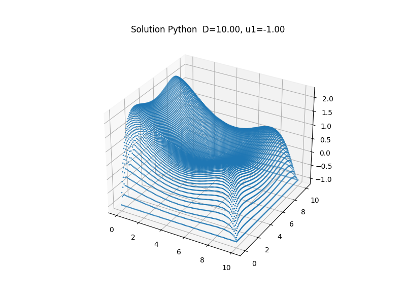
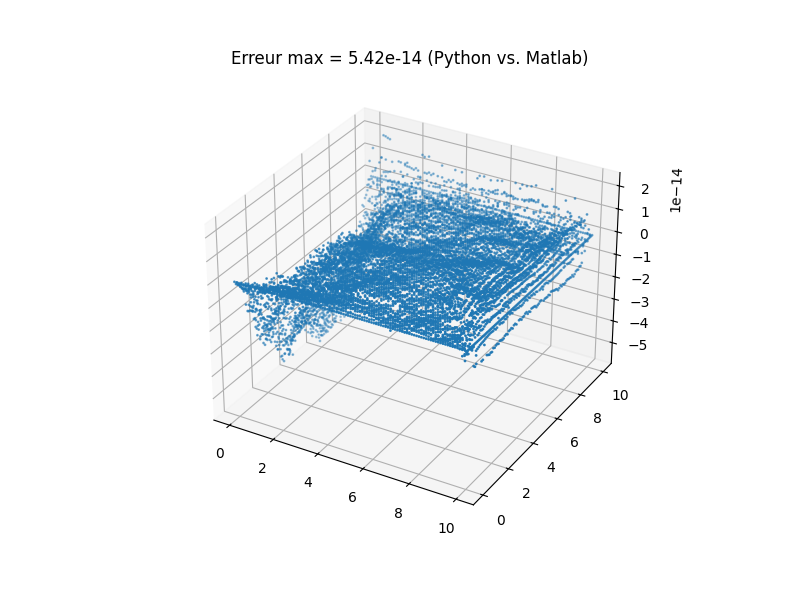

# Méthode des éléments finis en Python

## Description des programmes

Une résolution numérique de l'équation $-\Delta u+au=f$ est proposée dans ce notebook, avec des exemples où le domaine de définition $\Omega$ est la section d'un coaxial (rayon interne r1 et rayon externe r2) et des conditions aux limites de Dirichlet aux frontières (u1 sur le cercle de rayon r1 et u2 sur le cercle de rayon r2).

Pour une comparaison avec les résultats obtenus dans Matlab (toolbox PDE), les données issues de Matlab sont sauvegardées dans les fichiers ci-dessous

*   **nodes.csv** : liste des noeud du maillage avec leurs coordonnées, obtenue dans Matlab
*   **elements.csv** : liste des triangles dont les sommets sont désignés par des index dans la liste des noeuds
*   **solution.csv** : solution de l'approximation obtenue dans Matlab
*   **labels.csv** : labels associés aux noeuds (0 : inconnue, 1 : condition aux limites avec r1, 2 : condition aux limites avec r2)
*   **params.csv** : paramètres r1, r2, u1, u2, a, f

La fonction **coaxial_matl** réalise cette comparaison.

Les fonctions **coaxial_circ** et **coaxial_hexa** utilisent uniquement Python pour générer le maillage et obtenir l'approximation de la solution.

La fonction **solve_edp** dans **elements_finis.py** peut s'appliquer à d'autres géométries que celles données dans les exemples. Cependant, il faudra aussi définir préalablement le maillage, avec la construction des listes **triangles**, **points** et **labels**. En complément de ce choix d'autres géométries, il est par ailleurs possible d'imposer aussi des conditions de Neumann homogènes (voir le fichier **domaine_carre.zip** dans le dossier **Code**, ainsi que les illustrations)

## Version Notebook

Le fichier notebook fourni genère les fichiers **CSV** permettant la comparaison avec **Matlab** pour une configuration particulière des paramètres. Dans l'état, il peut être directement utilisable dans **Google Colaboratory**, par exemple.

## Version Code

Les programmes donnés en exemple peuvent être lancés directement dans une console **Python**. Si on dispose de **Matlab**, le fichier **elements_finis.m** permet éventuellement de tester d'autres configurations, en générant les fichiers **CSV** associés.

## Site intéressant
Dans le programme **elements_finis.py** (fonction **solve_edp**), les matrices dites de masse et de rigidité sont calculées simultanément. Le détail des calculs est décrit dans le site ci-dessous.

https://bthierry.pages.math.cnrs.fr/course-fem/lecture/elements-finis-triangulaires/contributions-elementaires/

## Illustrations
### Comparaison avec Matlab

Le maillage est récupéré à partir des données générées dans Matlab.

La solution est calculée avec la fonction **solve_edp**.

On compare la solution calculée avec la fonction **solve_edp** et celle de Matlab, pour valider le programme **Python** fourni.

### Maillage circulaire

Le maillage est généré avec **Python**.

La solution est calculée avec la fonction **solve_edp**.

### Maillage hexagonal

Le maillage est généré avec **Python**.

La solution est calculée avec la fonction **solve_edp**.

## Autres géométries

### Comparaison avec Matlab

Le maillage est récupéré à partir des données générées dans Matlab.

La solution est calculée avec la fonction **solve_edp**.

On compare la solution calculée avec la fonction **solve_edp** et celle de Matlab, pour valider le programme **Python** fourni.

### Maillage à base de carrés

Le maillage est généré avec **Python**.

La solution est calculée avec la fonction **solve_edp**.

